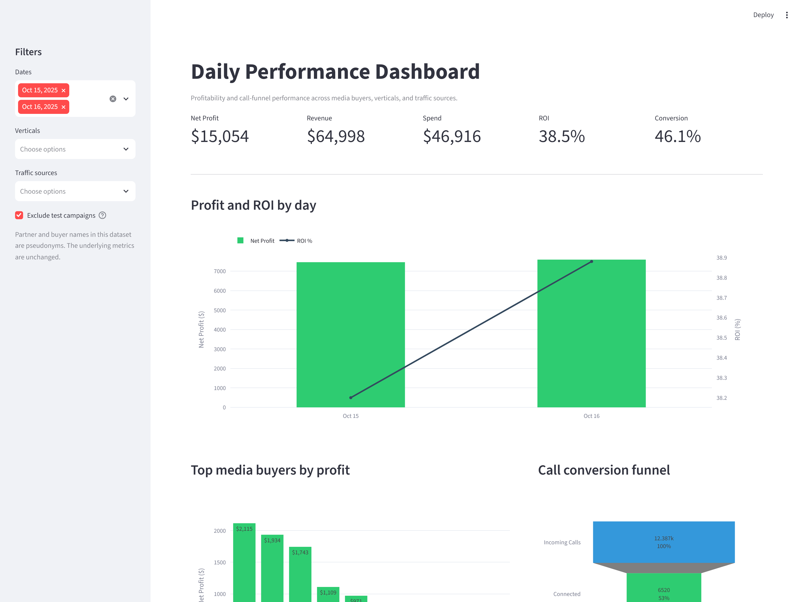

# Daily Performance Dashboard

An interactive Streamlit dashboard for a pay-per-call lead generation operation, turning a
daily spreadsheet export into the answer buyers actually need each morning: which media
buyers made money yesterday, where calls fell out of the funnel, and whether affiliate
traffic outperformed traffic bought in house.



## The problem

A call-based lead generation business buys traffic from dozens of media buyers across
several insurance verticals. Every campaign has its own spend, revenue, platform fee, and
call funnel, and the daily export lands as a wide spreadsheet with 27 columns of mixed
rates, counts, and currency.

Reading that spreadsheet by eye answers none of the questions that matter:

- Which buyers are carrying the day, and which are quietly burning budget?
- Where are calls lost — before connecting, or after?
- Is affiliate traffic actually more profitable than internal buying, or just larger?

This dashboard answers all three in a single screen, with filters for narrowing to a
vertical, a traffic source, or a specific day.

## What it shows

| Panel | Question it answers |
| --- | --- |
| KPI strip | What were profit, revenue, spend, ROI, and conversion for the selection? |
| Profit and ROI by day | Is profitability trending with volume, or diverging from it? |
| Top media buyers by profit | Who contributed profit, and who lost money? |
| Call conversion funnel | How many incoming calls connected, and how many converted? |
| Affiliate versus internal | Which sourcing model performs better on rate, not just volume? |

Every panel responds to the sidebar filters, so the same layout works for a single vertical
or the whole book of business.

## Analytical decisions worth noting

**Test campaigns are excluded by default.** Rows spending under $50 are smoke tests, not
funded campaigns. Left in, they distort rate metrics badly — a campaign that spends $4 and
earns $12 posts a 200% ROI that means nothing. The sidebar exposes this as a toggle rather
than hiding it in the code.

**Segments are compared on rates, not just totals.** Affiliate traffic is far larger than
internal traffic here, so comparing absolute profit only tells you which is bigger. The
rate chart puts ROI, margin, and conversion side by side, which is the comparison that
informs a budget decision.

**Rate calculations guard their denominators.** A filter combination that returns no
connected calls returns a zero conversion rate instead of raising, so the dashboard degrades
gracefully rather than erroring on an empty selection.

## Data and privacy

The workbook in `data/` is derived from a real operation, with a deliberate change: **every
media buyer and partner name is a pseudonym.** All financial and funnel metrics are the
original values, so the analysis and the charts are faithful, but no real partner identity,
rate, or relationship is exposed.

The mapping is applied by [`scripts/anonymize_source_data.py`](scripts/anonymize_source_data.py),
which assigns each real identity a stable pseudonym matching its type — agency-style names
for affiliate partners, first names for internal buyers — so repeat runs produce consistent
output. Raw exports are gitignored and never committed.

## Running it locally

```bash
git clone https://github.com/niksaderek/daily-performance.git
cd daily-performance

python -m venv .venv
source .venv/bin/activate      # Windows: .venv\Scripts\activate

pip install -r requirements.txt
streamlit run app.py
```

The dashboard opens at <http://localhost:8501>.

### Tests

```bash
pip install -r requirements-dev.txt
pytest
```

The suite covers the metric aggregations — profit and rate arithmetic, funnel stage ordering,
segment splitting, and the zero-denominator paths that empty filter selections produce.

## Project layout

```
app.py                              Streamlit entry point: filters, layout, panels
src/data.py                         Workbook loading, column normalization, filtering
src/metrics.py                      KPI, trend, leaderboard, funnel, and segment aggregations
src/charts.py                       Plotly figure construction and shared styling
scripts/anonymize_source_data.py    Maps real partner identities onto stable pseudonyms
tests/test_metrics.py               Unit tests for the aggregation layer
data/daily.xlsx                     Anonymized performance export
```

Metrics are kept separate from charts so the aggregations stay testable without a browser or
a running Streamlit session.

## Built with

Python · pandas · Plotly · Streamlit · pytest

## License

[MIT](LICENSE)
